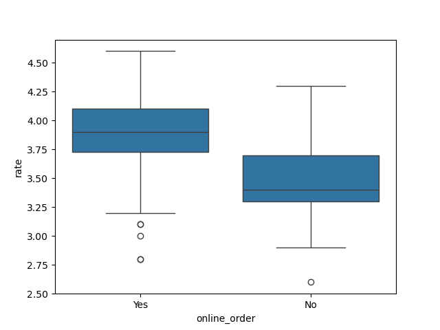
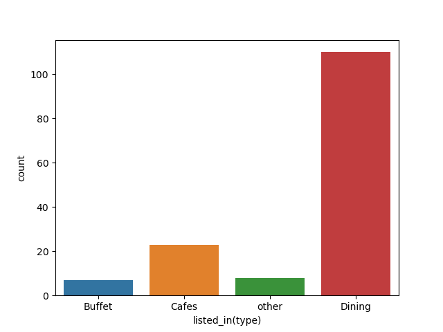

# zomato-restaurant-analysis
Exploratory data analysis of Zomato restaurant data using Python, Pandas &amp; Seaborn. uncovering trends in online ordering, restaurant types, pricing, and customer ratings.

## 📌 Objective
Analyze 148 restaurant listings to answer:
- Do most restaurants support online ordering?
- Which restaurant types dominate the market?
- How does online ordering relate to customer ratings?
- What price point do most customers target?

## 🛠️ Tools & Libraries
- Python
- Pandas — data cleaning & aggregation
- Matplotlib / Seaborn — visualization
- NumPy

## 🧹 Data Cleaning
- Checked and removed duplicate rows
- Parsed the `rate` column (e.g. "4.1/5" → 4.1) and converted to numeric
- Verified no missing values across all 7 columns

## 📊 Key Findings

| Question | Finding |
|---|---|
| Online vs offline orders | Majority of restaurants do **not** accept online orders |
| Most common restaurant type | **Dining** dominates the dataset |
| Highest engagement type (by votes) | **Dining** restaurants receive the most votes overall |
| Top restaurant (weighted rating) | **Empire Restaurant** (rating × votes) |
| Typical price point | Most restaurants cost **₹300 for two** |
| Rating distribution | Most restaurants rate between **3.5–4.0** |
| Ratings by order mode | Restaurants accepting online orders have **higher median ratings** than offline-only ones |
| Type vs order mode | Dining restaurants mostly operate **without** online ordering; Cafes lean more toward online ordering |

## 📈 Sample Visuals



## 🚀 How to Run
```bash
git clone <your-repo-url>
cd zomato-data-analysis
pip install pandas matplotlib seaborn numpy
jupyter notebook Zomato_dataAnalysis.ipynb
```

## 📂 Repo Structure
```
├── data/
│   └── Zomato-data-.csv
├── notebooks/
│   └── Zomato_dataAnalysis.ipynb
├── images/
│   └── (exported chart PNGs)
└── README.md
```
